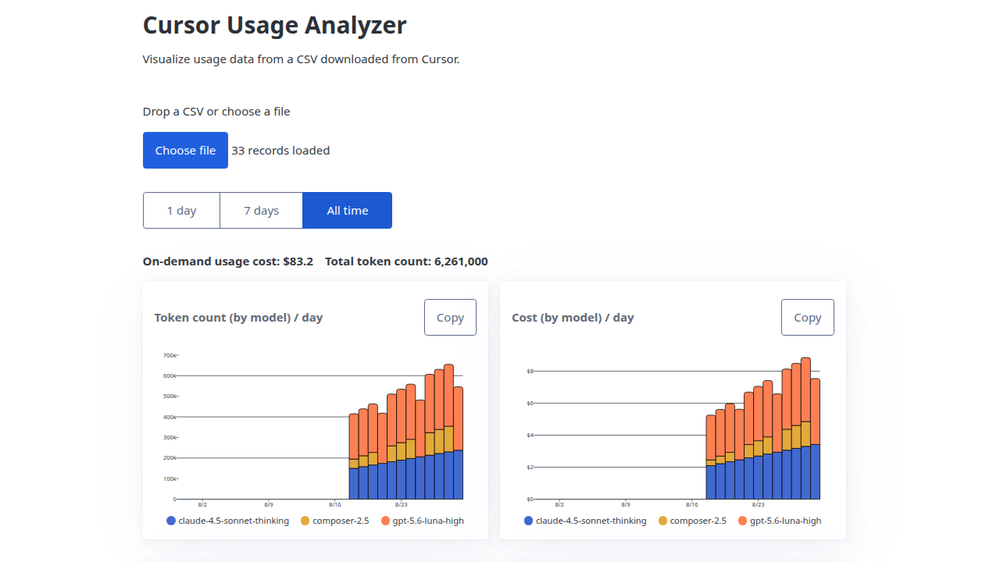
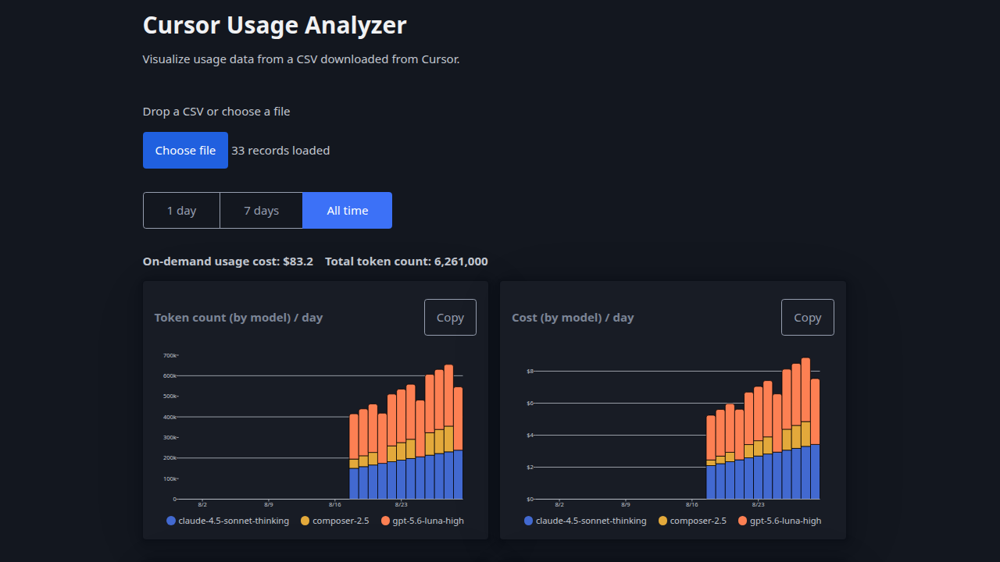

# Cursor Usage Analyzer

Visualize usage data from a CSV downloaded from Cursor.

Try it on!: https://moko256.github.io/cursor_usage_analyzer/

## License

GNU Affero General Public License v3.0 or later

`AGPL-3.0-or-later`
